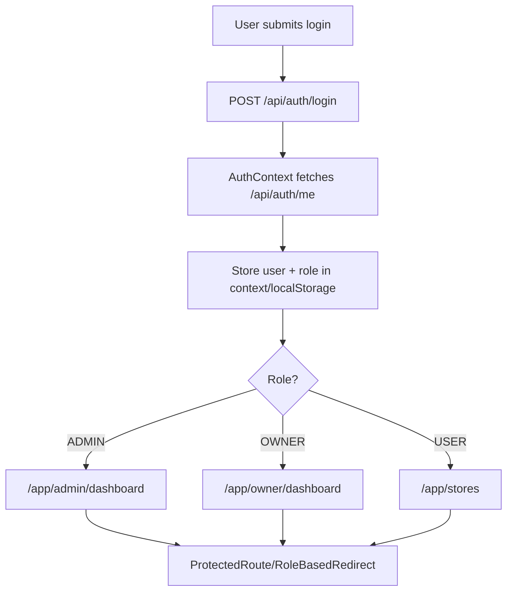
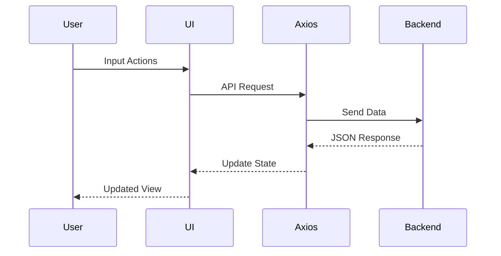

# RateMyStore Frontend

A modern React (Vite) frontend for the RateMyStore platform with role-based experiences for Users, Owners, and Admins.

---

## Navigation Table

| Section | Description |
| --- | --- |
| [Overview](#overview) | What the frontend does |
| [Tech Stack](#tech-stack) | Libraries & why chosen |
| [Folder Structure](#folder-structure) | Explanation of key files |
| [Auth Flow](#auth-flow) | Diagram + explanation |
| [Data Flow](#data-flow) | UI → API → UI cycle |
| [Setup](#installation--setup) | How to run the project |
| [Features](#features) | Complete feature list |
| [UI/UX Design](#uiux-design-notes) | Why this design approach |
| [API Endpoints](#api-endpoints-used) | Backend routes consumed |
| [Screenshots](#screenshots--gifs) | Placeholder image section |

---

## Overview

RateMyStore Frontend delivers a role-aware experience for customers, store owners, and admins:
- **Purpose**: Browse, rate, and manage stores with clear, secure user flows.
- **Key modules**: Authentication, Role-based routing, Owner Dashboard, Admin Dashboard, Ratings UI.
- **Flow**: Login → Role-based redirect → Protected dashboards → Ratings and management actions.
- **Design**: Clean, card-based UI, responsive grids, Tailwind-driven spacing and typography.

---

## Tech Stack

- **React**: Component-driven UI for fast iteration and stateful views.
- **Vite**: Lightning-fast dev server and builds for React apps.
- **React Router**: SPA routing with nested routes and guards.
- **TailwindCSS**: Utility-first styling for consistent spacing, typography, and responsive grids.
- **Axios**: Promise-based HTTP client with interceptors and `withCredentials` for auth cookies.
- **React Icons (lucide-react)**: Lightweight icon set for consistent visuals.
- **Context API**: Global auth state, roles, and session restoration across the app.
- **Toast component**: Non-blocking feedback for successes/errors (login, CRUD, ratings).

---

## Folder Structure

- `src/router.jsx` — Defines all routes, role-based guards (ProtectedRoute), and landing/login flows.
- `src/context/AuthContext.jsx` — Manages login/logout, session restoration (`/api/auth/me`), role state, and provides auth context.
- `src/pages/*.jsx` — Screen-level views (Login, Signup, Stores, Admin dashboard, Owner dashboard, etc.). Each page focuses on layout & data fetching.
- `src/components/*.jsx` — Reusable UI/guard pieces (ProtectedRoute, RoleBasedRedirect, Toast, RatingModal, etc.). Keeps pages lean.
- `src/lib/apiClient.js` — Axios instance with base URL/env config and credential handling.
- `src/assets/` & `public/` — Static assets (logos, illustrations, feature icons, backgrounds) used across landing and dashboards.

Why these matter:
- **Router** organizes navigation and protects role-specific areas.
- **AuthContext** ensures a single source of truth for user/role and keeps users logged in after refresh.
- **Pages** own layout and fetching; **components** stay reusable and stateless where possible.
- **apiClient** standardizes calls and credentials, reducing boilerplate.

---

## Auth Flow
## Auth Flow



Explanation:
- After login, AuthContext calls `/api/auth/me` to hydrate the session and caches the user/role (localStorage + context).
- On refresh, AuthContext restores session by re-calling `/api/auth/me`.
- `ProtectedRoute` blocks unauthenticated or disallowed roles; `RoleBasedRedirect` sends users to the correct dashboard.

---

## Data Flow



Lifecycle:
1) User interacts with UI → triggers an action. 2) UI uses `apiClient` (Axios) to call backend. 3) Backend responds with JSON. 4) UI updates context/state. 5) Updated view reflects new data (ratings, dashboards, etc.).

---

## Installation & Setup

### Prerequisites
- Node.js 18+
- npm (bundled with Node)

### Environment Variables
Create `Frontend/.env` (or `.env.local`):
```bash
VITE_API_BASE_URL=http://localhost:3000
```
(Adjust to your backend host/port.)

### Install
```bash
cd Frontend
npm install
```

### Run (dev)
```bash
npm run dev
```
Vite will output the local dev URL (default http://localhost:5173).

### Build
```bash
npm run build
```

---

## Features

- 🔐 Authentication (login, register) with session restore.
- ✅ Authorization with role-based routing (USER / OWNER / ADMIN).
- 🛍 Owner Dashboard — supports multiple stores, ratings overview.
- 🛠 Admin Dashboard — manage users/stores, view counts.
- ⭐ Ratings & Reviews — users rate stores, view averages and counts.
- 🔔 Toast notifications — success/error feedback.
- 📱 Responsive UI — mobile → desktop, grids and cards adapt.

---

## UI/UX Design Notes

- **Tailwind**: Rapid, consistent spacing/typography, easy theming.
- **Card-based design**: Groups related info (stores, ratings) for quick scanning.
- **Responsive grid**: 1/2/3-column layouts for mobile/tablet/desktop.
- **Consistent components**: Reusable guards, toasts, and cards reduce cognitive load.

---

## API Endpoints Used

**Auth**
- POST `/api/auth/login`
- POST `/api/auth/signup`
- POST `/api/auth/logout`
- GET `/api/auth/me`

**Store**
- GET `/api/stores`
- GET `/api/stores/:id`
- POST `/api/stores` (owner/admin)
- PUT `/api/stores/:id` (owner)
- DELETE `/api/stores/:id` (admin)

**Rating**
- POST `/api/ratings/store/:storeId` (user)
- GET `/api/ratings/store/:storeId`
- PUT `/api/ratings/:ratingId` (user)
- DELETE `/api/ratings/:ratingId` (user)

**Admin**
- GET `/api/admin/dashboard`
- POST `/api/admin/users`
- GET `/api/admin/users`
- GET `/api/admin/users/:id`
- POST `/api/admin/stores`
- GET `/api/admin/stores`

**Owner**
- GET `/api/owner/dashboard`

---

## Screenshots / GIFs

## Screenshots

### Landing Page


### Login


### Owner Dashboard


### Admin Dashboard


---

## Why This Frontend Works

- Clear separation of concerns (routing, context, pages, components, api client).
- Robust auth & role handling with redirects and protected routes.
- Responsive, card-driven UI suited for store discovery and management.
- Developer-friendly setup (Vite, Tailwind, Axios, Context) for fast iteration.

---

## Contributing

1. Fork & branch
2. Commit with clear messages
3. Open a PR with screenshots/notes

---
